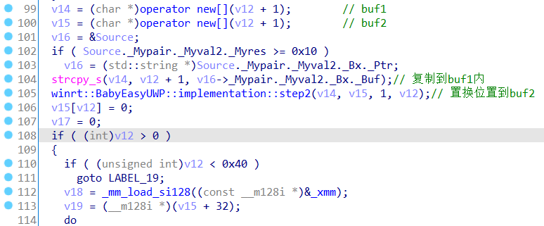
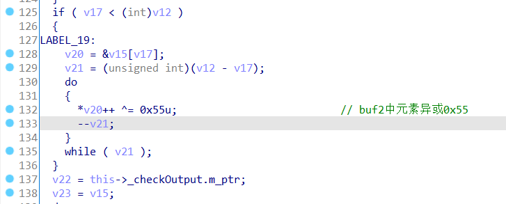

## baby_easy_UWP

难度：1/5，考点：有符号UWP，异或加密+置换顺序

**题目描述：**

听说本题可以一键暴打出题人？出题人会想出什么办法应对呢？走过路过不要错过，快来看看吧。

本题无毒无害，使用管理员身份运行Install-Cert.ps1（安装证书）之后运行Install.ps1（安装app）或者手动添.加证书到Local Machine（而不是Current User）的Trusted People，之后双击appxbundle文件安装。附带的证书在5月24日晚上7点过期，所以可以放心安装。

本题的flag不含TSCTF{}包裹，请解出后加上再提交。

**题目附件：**

BabyEasyUWP_1.0.0.0_Test.7z

**flag**:

tsctf{347Baby03-5EasY18247CHEckln320860_0}


注：由于本题证书过期得比较早，可能导致比赛结束后直接下载附件不能安装。


### 编译运行

C++/WinRT项目

visual2019中勾选 通用Windows平台开发


### 前言

本题基于C++/WinRT的[HelloWorld 示例程序](https://docs.microsoft.com/en-us/windows/uwp/get-started/create-a-basic-windows-10-app-in-cppwinrt)改编而来。

设计目标：难点不在算法，而是对新UWP应用架构的学习。希望在界面里能加上一些有趣的元素。

算法设计：异或加上完全二叉树的数组表示通过中序遍历打乱顺序。而且这两步解密的顺序可以交换，因为一个是异或单字节，一个是纯打乱顺序。

 用户输入->循环异或上tsctf2021->打乱顺序->结果比较。

题目关键部分源码如下：

```c++
	char* resultBuffer;
    int counter = 0;
    void step1(char* buffer, int len) {
        for (int i = 0; i < len; i++) {
            buffer[i] ^= 'U';
        }
    }
    void step2(char* buffer, char* resultBuffer, int root, int len) {
        if (root > len) {
            return;
        }
        step2(buffer, resultBuffer, 2 * root, len);
        resultBuffer[counter++] = buffer[root - 1];
        step2(buffer, resultBuffer, 2 * root + 1, len);
    }

    void MainPage::inputButton_Click(
        winrt::Windows::Foundation::IInspectable const& sender,
        winrt::Windows::UI::Xaml::RoutedEventArgs const& e)
    {
        counter = 0;
        auto flag_input = flagInput().Text();
        std::string flag = winrt::to_string(flag_input);
        size_t len = flag.size();
        char* buffer = new char[len+1];
        char* resultBuffer = new char[len + 1];
        strcpy_s(buffer, len+1, flag.c_str());
        step2(buffer, resultBuffer, 1, len);
        resultBuffer[len] = '\x00';
        step1(resultBuffer, len);
        if (!strcmp(resultBuffer, this->cipertext)) {
            checkOutput().Text(L"Right!!!");
        }
        else {
            checkOutput().Text(L"Wrong flag!");
        }
        delete[] buffer;
        delete[] resultBuffer;
        return;
    }
```

### 做题步骤

出题人预计的解题步骤如下：

1. 解包appx与环境搭建

   appxbundle包和appx包就都是zip，直接用7zip打开，解压得到里面的exe。

   另外一个关键点就是本题是给出了符号信息的，直接7zip打开.appxsym文件解压得到pdb。ida打开exe然后导入pdb就可以得到所有的函数名等信息了。

2. 找到关键部分代码

   根据函数名找到`MainPage::inputButton_Click`函数。

   

   

3. 调试App

   procexp可以直接通过窗口找到进程，找到进程的PID然后直接attach即可。然后在`MainPage::inputButton_Click`函数下断点。之后就和普通的windows程序调试类似。

   IDA调试会发现下载很大的文件，auto analysis也一直在分析库文件，不会停下来。首先attach前在Options - General里的Analysis Tab下的Analysis框里的Enable取消勾选，取消自动分析。然后Attach的时候在Download xxx bytes的窗口直接点取消。然后来到`MainPage::inputButton_Click`函数下断点即可。

4. 解密算法

   ```python
   class randomizer:
       '''
       完全二叉树的数组表示（层序遍历存放时），下标为x的节点的左孩子下标为2x，右孩子为2x+1。（下标从1开始）
       加密是层序遍历转中序遍历。
       '''
       def __init__(self):
           self.result = ''
           self.to_encrypt = ''
           self.length = 0
       def traverse(self, root):
           if root > self.length:
               return
           self.traverse(2*root)
           self.result += self.to_encrypt[root-1]
           self.traverse(2*root+1)
   
       def randomize(self, s):
           self.length = len(s)
           self.to_encrypt = s
           self.traverse(1)
           return self.result
   
   
   class derandomizer:
       '''
       解密时是建树，中序遍历的过程中填进去，
       '''
       def __init__(self):
           self.result = []
           self.to_decrypt = ''
           self.length= 0
           self.counter = 0
       def traverse(self, root):
           if root > self.length:
               return
           self.traverse(2*root)
           self.result[root-1] = self.to_decrypt[self.counter]; self.counter += 1
           self.traverse(2*root+1)
       def derandomize(self, s):
           self.length = len(s)
           self.to_decrypt = s
           self.result = ['a' for i in range(self.length)]
           self.traverse(1)
           return ''.join(self.result)
   
   def xorer(s):
       b = s.encode('ascii')
       result = []
       for i in b:
           result.append(i ^ ord('U'))
       return bytes(result)
   
   def dexorer(b):
       result = []
       for i in b:
           result.append(i ^ ord('U'))
       return bytes(result).decode("ascii")
   
   cipertext = b'cdee\nme\x17gfaabx\x164\x1d`\x10f6\x10>794;bf&g,e\x0cm'
   
   randomized = dexorer(cipertext)
   # print(randomized)
   
   derandomized = derandomizer().derandomize(randomized)
   print(derandomized)
   
   # ------------
   
   # derandomized = "347Baby03-5EasY18247CHEckln320860_0"
   
   # randomized = randomizer().randomize(derandomized)
   # print(randomized)
   
   # xored = xorer(randomized)
   # print(xored)
   ```
   
   解密得到flag的脚本在decrypt.py。


### 创建对应日期失效的证书

怎么创建证书来着？？？？原来这里删除之前的证书就可以了。。。密码设置成`QjgumzpfAvzEQRZNZB6Y`。

直接创建不能设置失效时间，默认是一年的有效期啊。。。需要设置成5月23号后失效的，设置到5月24号吧。

跟随 https://docs.microsoft.com/en-us/windows/msix/package/create-certificate-package-signing 创建吧。

Publisher: CN=warren

```powershell
New-SelfSignedCertificate -Type Custom -Subject "CN=warren" -KeyUsage DigitalSignature -FriendlyName "warren" -NotAfter (Get-Date).AddDays(18) -CertStoreLocation "Cert:\CurrentUser\My" -TextExtension @("2.5.29.37={text}1.3.6.1.5.5.7.3.3", "2.5.29.19={text}")
$password = ConvertTo-SecureString -String QjgumzpfAvzEQRZNZB6Y -Force -AsPlainText
# PfxCertificate -cert "Cert:\CurrentUser\My\33BEBF9994A12F5805B7FBD2CC4124E69D9010A2" -FilePath "C:\Users\warren\source\repos\BabyEasyUWP\BabyEasyUWP_TemporaryKey.pfx" -Password $password
Get-ChildItem -Path Cert:\CurrentUser\My\33BEBF9994A12F5805B7FBD2CC4124E69D9010A2 | Export-PfxCertificate -FilePath "C:\Users\warren\source\repos\BabyEasyUWP\BabyEasyUWP_TemporaryKey.pfx" -Password $password

```

使用`Remove-Item .\0BB1A23183320F92165622AA00C41A6ADAE0AAD1`删除其他不用的证书

原来只要添加到local machine的trusted people就可以了啊。。。或者自签名在把自己的证书添加到local machine的受信任的根证书。这个`Add-AppDevPackage`有添加证书的功能。

```powershell
# Install-Cert.ps1
$currLocation = Get-Location
Set-Location $PSScriptRoot
Invoke-Expression ".\Add-AppDevPackage.ps1 -CertificatePath .\BabyEasyUWP_1.0.0.0_x86_x64.cer"
Set-Location $currLocation
```

