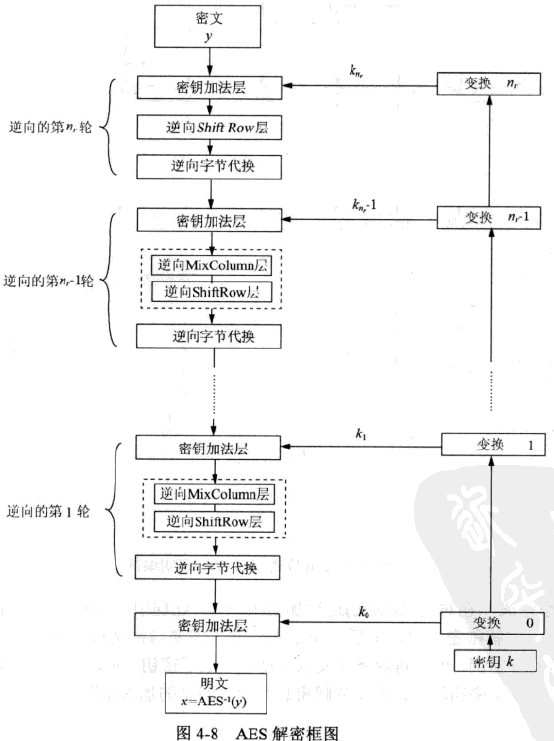

## yet-another-lua-ext

难度：3/5，考点：AES硬件加速指令集，lua C API

题目描述：

```
真的就是简单的lua代码，快来看看。但是不要乱改啊！
运行方式：./lua.elf ./checker.lua
本题的flag不含TSCTF{}包裹，请解出后加上再提交。
```

题目附件：

- lua-ext.zip
  - lua.elf
  - checker.lua

hint：yet-another-lua-ext：AES-NI解密如果出现问题，注意AESIMC指令的作用。（Equivalent Inverse Cipher）


### 题目编译步骤

1. 下载lua5.4.3源码，在src/Makefile里修改`MYCFLAGS= -maes -O1`，编译得到liblua.a，放到最外层目录
2. 使用make.sh编译得到lua.elf


### 前言

题目源码放在github上：

推荐阅读《Programming in Lua》的Lua C API部分。

本题主要考察的是AES硬件指令集，和lua解释器的C API。放题前想加上Link Time Optimization，真是优化得和源代码完全不一样了。想了想还是算了，不利于学习lua的C API。所以就留下了库函数的符号信息，只去掉了题目代码的符号信息。

出题时尽量减少了非关键点的难度。没有使用link time optimization从而保留了源码中函数的结构，保留了符号信息只去掉了少数几个符号，保留了完整的AES subkey从而aesenc指令可以发现偏移确实是突然跳过了一个subkey。AES也只是小改。

出题时对照https://www.cryptool.org/en/cto/aes-step-by-step 可以对比发现subkey就是标准AES的subkey，从而希望做题者能够迅速对照修改得到解密算法。

首先是打乱了执行顺序，先执行奇数行，再执行偶数行，并且跳过了第16行。而且是先组合成正确的代码字符串再加载给lua的。所以可以下断点直接获取正确的代码。

首先是模仿CTR模式，加密了全零，异或上flag，然后再把flag加密一次。不知道有没有人通过CTR模式加密全零的结果和标准AES对比看出，虽然subkeys确实是正常AES的，但是其实不是标准的AES算法。

AES硬件指令写加密容易，写解密就稍微要理解一下AES的等效解密算法，也就是注意一下子密钥要inverse mix column，这也是为什么AES加速指令提供了inverse mix column指令。但是如果是从网上找的AES-NI的加解密直接改的话或许不用理解这部分也可以吧。

AES-NI解密特殊的地方在于，它也是最后一轮使用`aesdeclast`，这一特殊的指令，而如果把解密和加密一一对应起来，则不应该是第一轮特殊处理，而后面几轮一样吗？这是因为AES-NI用的是`Equivalent Inverse Cipher` 一种和AES加密结构相同的解密方式。这种方式利用了轮密钥加和逆MixColumn层可以交换的特性。



此图，从上到下看，把第一个轮密钥加对应上AES加密额外的轮密钥加，然后把之后的每四个作为一组，交换逆MixColumn和轮密钥加，就可以发现和加密的结构一致了。每一轮都是 ShiftRow -> 字节代换 -> 逆MixColumn -> 轮密钥加 而且最后一轮没有逆MixColumn。

但是轮密钥加和逆MixColumn层交换了，会发现此时的轮密钥自身还需要按照逆MixColumn变换，这样最终异或上去才能达到相同的效果。所以在解密的时候，轮密钥还要用逆MixColumn处理，这也是为什么会提供`AESIMC`指令的原因。

解题步骤：

1. 在luaL_loadstring处下断点，获得正确的lua代码。
2. 了解AES-NI相关解密原理，将subkeys通过aesimc指令处理后调用相关的AES-NI解密指令，跳过中间一轮成功解密。

题目部分源码如下：

```c
uint8_t  subkeys[22][16] __attribute__ ((aligned (16)))  = {
0x77, 0x65, 0x6c, 0x63, 0x6f, 0x6d, 0x32, 0x74, 0x73, 0x63, 0x74, 0x66, 0x32, 0x30, 0x32, 0x31, // welcom2tsctf2021
0x72, 0x46, 0xab, 0x40, 0x1d, 0x2b, 0x99, 0x34, 0x6e, 0x48, 0xed, 0x52, 0x5c, 0x78, 0xdf, 0x63,
0xcc, 0xd8, 0x50, 0x0a, 0xd1, 0xf3, 0xc9, 0x3e, 0xbf, 0xbb, 0x24, 0x6c, 0xe3, 0xc3, 0xfb, 0x0f,
0xe6, 0xd7, 0x26, 0x1b, 0x37, 0x24, 0xef, 0x25, 0x88, 0x9f, 0xcb, 0x49, 0x6b, 0x5c, 0x30, 0x46,
0xa4, 0xd3, 0x7c, 0x64, 0x93, 0xf7, 0x93, 0x41, 0x1b, 0x68, 0x58, 0x08, 0x70, 0x34, 0x68, 0x4e,
0xac, 0x96, 0x53, 0x35, 0x3f, 0x61, 0xc0, 0x74, 0x24, 0x09, 0x98, 0x7c, 0x54, 0x3d, 0xf0, 0x32,
0xab, 0x1a, 0x70, 0x15, 0x94, 0x7b, 0xb0, 0x61, 0xb0, 0x72, 0x28, 0x1d, 0xe4, 0x4f, 0xd8, 0x2f,
0x6f, 0x7b, 0x65, 0x7c, 0xfb, 0x00, 0xd5, 0x1d, 0x4b, 0x72, 0xfd, 0x00, 0xaf, 0x3d, 0x25, 0x2f,
0xc8, 0x44, 0x70, 0x05, 0x33, 0x44, 0xa5, 0x18, 0x78, 0x36, 0x58, 0x18, 0xd7, 0x0b, 0x7d, 0x37,
0xf8, 0xbb, 0xea, 0x0b, 0xcb, 0xff, 0x4f, 0x13, 0xb3, 0xc9, 0x17, 0x0b, 0x64, 0xc2, 0x6a, 0x3c,
0xeb, 0xb9, 0x01, 0x48, 0x20, 0x46, 0x4e, 0x5b, 0x93, 0x8f, 0x59, 0x50, 0xf7, 0x4d, 0x33, 0x6c,
// 11
};

uint8_t plain[16] __attribute__ ((aligned (16)));
uint8_t computed[16] __attribute__ ((aligned (16))) ;

void aes_enc(uint8_t plain[]) {
    __m128i m = _mm_loadu_si128((const __m128i*) plain);
    m = _mm_xor_si128(m, *(__m128i*)subkeys[0]);
    m = _mm_aesenc_si128(m, *(__m128i*)subkeys[1]);
    m = _mm_aesenc_si128(m, *(__m128i*)subkeys[2]);
    m = _mm_aesenc_si128(m, *(__m128i*)subkeys[3]);
    m = _mm_aesenc_si128(m, *(__m128i*)subkeys[4]);
    // m = _mm_aesenc_si128(m, *(__m128i*)subkeys[5]);
    m = _mm_aesenc_si128(m, *(__m128i*)subkeys[6]);
    m = _mm_aesenc_si128(m, *(__m128i*)subkeys[7]);
    m = _mm_aesenc_si128(m, *(__m128i*)subkeys[8]);
    m = _mm_aesenc_si128(m, *(__m128i*)subkeys[9]);
    m = _mm_aesenclast_si128(m, *(__m128i*)subkeys[10]);
    _mm_storeu_si128((__m128i_u *)computed, m);
}

int lua_enc(lua_State* L)
{
    const char *s = luaL_checkstring(L, 1);
    lua_Unsigned len = lua_rawlen(L, 1);
    if (len != 16) {
        return luaL_error(L, "enc: strlen not 16");
    }
    memcpy(plain, s, 16);
    aes_enc(plain);
    lua_pushlstring(L, (const char *)computed, 16);
    return 1;
}

char* arr[50];
int arr_ind = 0;

char* process_code(char* code_path) {
    char* buf = malloc(0x1000);
    buf[0] = '\x00';
    FILE* fp = fopen(code_path, "r");
    if (fp == NULL) {
        printf("open %s failed.\n", code_path);
        exit(-1);
    }

    char *line = NULL;
    size_t len = 0;
    ssize_t read;

    for(int i=1;i<=50 && (read = getline(&line, &len, fp)) != -1;i++) {
        if (i == 17) {
            free(line);
            line = NULL;
            len = 0;
            continue;
        }
        if (i % 2 == 1) {
            if (line != NULL) {
                strcat(buf, line);
                free(line);
                line = NULL;
                len = 0;
            }
        } else {
            arr[arr_ind] = line;
            arr_ind ++;
            line = NULL;
            len = 0;
        }
    }
    for(int i=0;i<arr_ind;i++) {
        if (arr[i] != NULL) {
            strcat(buf, arr[i]);
            free(arr[i]);
            arr[i] = NULL;
        }
    }
    return buf;

}

int main(int argc, char* argv[]) {
    if (argc < 2) {
        printf("Usage: %s lua.elf <path to checker.lua>\n", argv[0]);
        exit(-1);
    }
    char* code_path = argv[1];
    char* code = process_code(code_path);
    // printf("%s", code);
    // exit(0);

    lua_State *L = luaL_newstate();
    luaL_openlibs(L);

    // TODO setup funcs
    lua_pushcfunction(L, lua_enc);
    lua_setglobal(L, "enc");

    int error = luaL_loadstring(L, code) || lua_pcall(L, 0, 0, 0);
    if (error) {
        const char * error_str = lua_tostring(L, -1);
        puts("script error:");
        puts(error_str);
        lua_pop(L, 1);  /* pop error message from the stack */
        exit(-1);
    }
    lua_close(L);
    return 0;
}
```

题目解密脚本如下：

```c
#include <stdint.h>     //for int8_t
#include <stdio.h>
#include <string.h>
#include <wmmintrin.h>

// gcc ./wp-dec.c -maes -msse2 -g -O1 -o wp-dec
// 开了O1之后才会有简单的汇编。
// https://www.cryptool.org/en/cto/aes-step-by-step

static uint8_t  subkeys[22][16] __attribute__ ((aligned (16)))  = {
0x77, 0x65, 0x6c, 0x63, 0x6f, 0x6d, 0x32, 0x74, 0x73, 0x63, 0x74, 0x66, 0x32, 0x30, 0x32, 0x31, // welcom2tsctf2021
0x72, 0x46, 0xab, 0x40, 0x1d, 0x2b, 0x99, 0x34, 0x6e, 0x48, 0xed, 0x52, 0x5c, 0x78, 0xdf, 0x63,
0xcc, 0xd8, 0x50, 0x0a, 0xd1, 0xf3, 0xc9, 0x3e, 0xbf, 0xbb, 0x24, 0x6c, 0xe3, 0xc3, 0xfb, 0x0f,
0xe6, 0xd7, 0x26, 0x1b, 0x37, 0x24, 0xef, 0x25, 0x88, 0x9f, 0xcb, 0x49, 0x6b, 0x5c, 0x30, 0x46,
0xa4, 0xd3, 0x7c, 0x64, 0x93, 0xf7, 0x93, 0x41, 0x1b, 0x68, 0x58, 0x08, 0x70, 0x34, 0x68, 0x4e,
0xac, 0x96, 0x53, 0x35, 0x3f, 0x61, 0xc0, 0x74, 0x24, 0x09, 0x98, 0x7c, 0x54, 0x3d, 0xf0, 0x32,
0xab, 0x1a, 0x70, 0x15, 0x94, 0x7b, 0xb0, 0x61, 0xb0, 0x72, 0x28, 0x1d, 0xe4, 0x4f, 0xd8, 0x2f,
0x6f, 0x7b, 0x65, 0x7c, 0xfb, 0x00, 0xd5, 0x1d, 0x4b, 0x72, 0xfd, 0x00, 0xaf, 0x3d, 0x25, 0x2f,
0xc8, 0x44, 0x70, 0x05, 0x33, 0x44, 0xa5, 0x18, 0x78, 0x36, 0x58, 0x18, 0xd7, 0x0b, 0x7d, 0x37,
0xf8, 0xbb, 0xea, 0x0b, 0xcb, 0xff, 0x4f, 0x13, 0xb3, 0xc9, 0x17, 0x0b, 0x64, 0xc2, 0x6a, 0x3c,
0xeb, 0xb9, 0x01, 0x48, 0x20, 0x46, 0x4e, 0x5b, 0x93, 0x8f, 0x59, 0x50, 0xf7, 0x4d, 0x33, 0x6c,
// 11
};

uint8_t plain[16] __attribute__ ((aligned (16)));
uint8_t computed[16] __attribute__ ((aligned (16))) = {0x55, 0xE2, 0xD0, 0x4A, 0x91, 0xAB, 0x5B, 0x89, 0x86, 0xD8, 0xE2, 0x83, 0x1F, 0x51, 0x8F, 0x88,} ;

void aes_enc(uint8_t plain[]) {
    __m128i m = _mm_loadu_si128((const __m128i*) plain);
    m = _mm_xor_si128(m, *(__m128i*)subkeys[0]);
    m = _mm_aesenc_si128(m, *(__m128i*)subkeys[1]);
    m = _mm_aesenc_si128(m, *(__m128i*)subkeys[2]);
    m = _mm_aesenc_si128(m, *(__m128i*)subkeys[3]);
    m = _mm_aesenc_si128(m, *(__m128i*)subkeys[4]);
    // m = _mm_aesenc_si128(m, *(__m128i*)subkeys[5]);
    m = _mm_aesenc_si128(m, *(__m128i*)subkeys[6]);
    m = _mm_aesenc_si128(m, *(__m128i*)subkeys[7]);
    m = _mm_aesenc_si128(m, *(__m128i*)subkeys[8]);
    m = _mm_aesenc_si128(m, *(__m128i*)subkeys[9]);
    m = _mm_aesenclast_si128(m, *(__m128i*)subkeys[10]);
    _mm_storeu_si128((__m128i_u *)computed, m);
}

void aes_dec(uint8_t ciper[]) {
    __m128i m = _mm_loadu_si128((const __m128i*) ciper);
    m = _mm_xor_si128(m, *(__m128i*)subkeys[10]);
    m = _mm_aesdec_si128(m, *(__m128i*)subkeys[11]);
    m = _mm_aesdec_si128(m, *(__m128i*)subkeys[12]);
    m = _mm_aesdec_si128(m, *(__m128i*)subkeys[13]);
    m = _mm_aesdec_si128(m, *(__m128i*)subkeys[14]);
    // m = _mm_aesdec_si128(m, *(__m128i*)subkeys[15]);
    m = _mm_aesdec_si128(m, *(__m128i*)subkeys[16]);
    m = _mm_aesdec_si128(m, *(__m128i*)subkeys[17]);
    m = _mm_aesdec_si128(m, *(__m128i*)subkeys[18]);
    m = _mm_aesdec_si128(m, *(__m128i*)subkeys[19]);
    m = _mm_aesdeclast_si128(m, *(__m128i*)subkeys[0]);
    _mm_storeu_si128((__m128i_u *)plain, m);
}

void dec_init() {
    _mm_storeu_si128((__m128i_u *)subkeys[11], _mm_aesimc_si128(*(__m128i*)subkeys[9]));
    _mm_storeu_si128((__m128i_u *)subkeys[12], _mm_aesimc_si128(*(__m128i*)subkeys[8]));
    _mm_storeu_si128((__m128i_u *)subkeys[13], _mm_aesimc_si128(*(__m128i*)subkeys[7]));
    _mm_storeu_si128((__m128i_u *)subkeys[14], _mm_aesimc_si128(*(__m128i*)subkeys[6]));
    _mm_storeu_si128((__m128i_u *)subkeys[15], _mm_aesimc_si128(*(__m128i*)subkeys[5]));
    _mm_storeu_si128((__m128i_u *)subkeys[16], _mm_aesimc_si128(*(__m128i*)subkeys[4]));
    _mm_storeu_si128((__m128i_u *)subkeys[17], _mm_aesimc_si128(*(__m128i*)subkeys[3]));
    _mm_storeu_si128((__m128i_u *)subkeys[18], _mm_aesimc_si128(*(__m128i*)subkeys[2]));
    _mm_storeu_si128((__m128i_u *)subkeys[19], _mm_aesimc_si128(*(__m128i*)subkeys[1]));
}

int main() {
    uint8_t dec1[16];
    dec_init();
    aes_dec(computed);
    memcpy(dec1, plain, 16);

    memset(plain, 0, 16);
    aes_enc(plain);
    uint8_t m[16];
    memcpy(m, computed, 16);
    for(int i=0;i<16;i++) {
        m[i] ^= dec1[i];
        printf("%c", m[i]);
    }
    puts("");

    return 0;
}
```

本次题目一个没有预料到的点是必须使用glibc2.29才能运行。算是一个小失误了。另外是对没有aes硬件加密指令的做题者不太友好。

